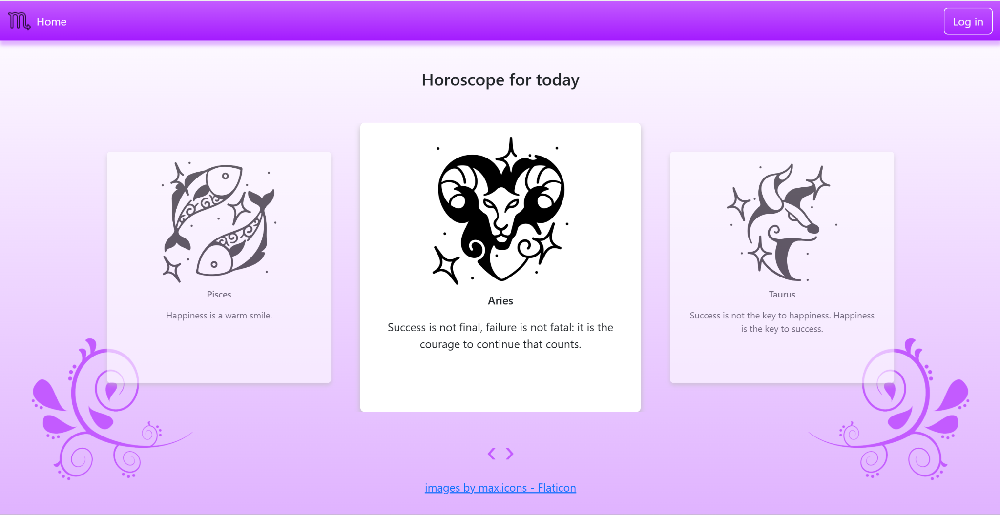

# 🔮 HoroscopeApp — Laravel Horoscope Web App

A Laravel-based horoscope viewer that fetches daily zodiac predictions from a public API and displays them in a stylish and intuitive interface.

## 👩‍💻 Developer’s Note

This project was built by Dzhesika Nimets as a practical exploration of Laravel fundamentals, cURL-based API integration, and Blade templating. The full setup — from environment configuration to final deployment — was done manually, including fixing dependency issues and database connectivity.

✅ Highlights of what was implemented:
- Setup of full Laravel backend environment using XAMPP
- cURL integration with the RapidAPI Horoscope API
- Error handling for API requests (e.g., invalid or missing response structure)
- Custom Blade UI with image carousel
- Testing across different local machines to debug environment-specific issues
- Logging of daily horoscopes into the database
- Automatic daily email sending of horoscopes via Laravel scheduler (cron job)

---

## 🧩 Features

- 🚀 Real-time horoscope retrieval via RapidAPI
- 👤 User authentication (login & registration)
- 📅 Daily forecast for each zodiac sign
- 🧠 Blade templating and Laravel routing
- 🎨 Carousel-based responsive UI
- 🛠️ Full environment setup (MySQL, migrations, artisan commands)
- 🔁 Cron-based scheduled tasks (logging & emailing horoscopes)
- 📧 Email delivery via Laravel Mail
- ❌ Error fallback when API data is incomplete

---

## 🛠 Tech Stack

- PHP 8.2+
- Laravel 10
- MySQL (via XAMPP)
- Blade
- cURL
- RapidAPI (horoscope endpoint)
- Laravel Scheduler & Mail

---

## 🔧 Local Installation

```bash
git clone https://github.com/your-username/horoscope-app.git
cd horoscope-app

composer install
cp .env.example .env
php artisan key:generate
php artisan migrate
php artisan serve
```

Then open `http://localhost:8000` in your browser.

Make sure to update `.env` with your RapidAPI and Mail credentials:

```env
API_KEY=your_api_key_here

MAIL_MAILER=smtp
MAIL_HOST=smtp.mailtrap.io
MAIL_PORT=2525
MAIL_USERNAME=your_username
MAIL_PASSWORD=your_password
MAIL_ENCRYPTION=null
MAIL_FROM_ADDRESS=horoscope@app.test
MAIL_FROM_NAME="HoroscopeApp"
```

To enable scheduled email delivery and logging, set up the Laravel cron scheduler:

```
* * * * * cd /path-to-your-project && php artisan schedule:run >> /dev/null 2>&1
```

---

## 🌍 API Used

- **Provider:** RapidAPI  
- **Endpoint:** `https://horoscope-astrology.p.rapidapi.com`  
- **Data Format:** JSON  
- **Auth:** Header-based API key

---


## 📸 Preview



---


## 🙌 Credits

- Horoscope API by [RapidAPI](https://rapidapi.com/)
- Icon design by [max.icons on Flaticon](https://www.flaticon.com/authors/maxicons)
